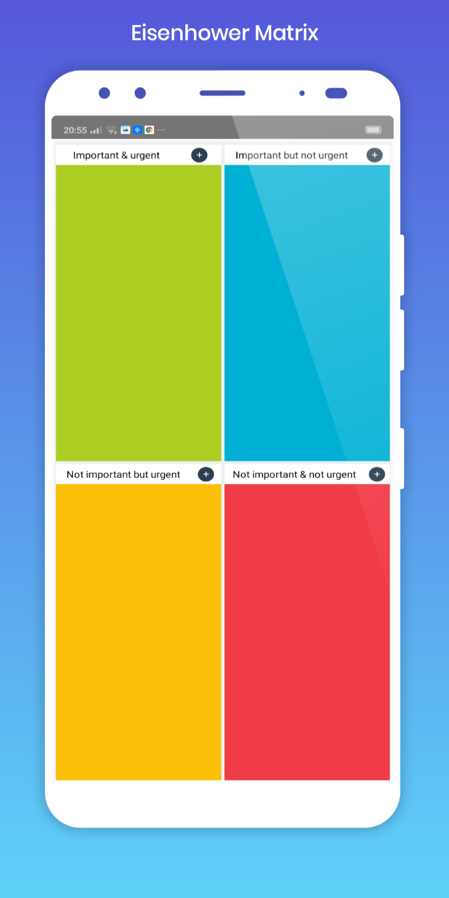

# Eisenhower Matrix

The Eisenhower Matrix is a productivity, prioritization, and time-management framework designed to help you prioritize a list of tasks or agenda items by first categorizing those items according to their urgency and importance.

|                          UI Preview                           |                          UI Preview                           |
| :-----------------------------------------------------------: | :-----------------------------------------------------------: |
|  |  |

Made with ❤ and React native
by : <a href= 'https://www.linkedin.com/in/ilies-ould-menouer-6a02111a2/' >ilies Ouldmenouer</a>
